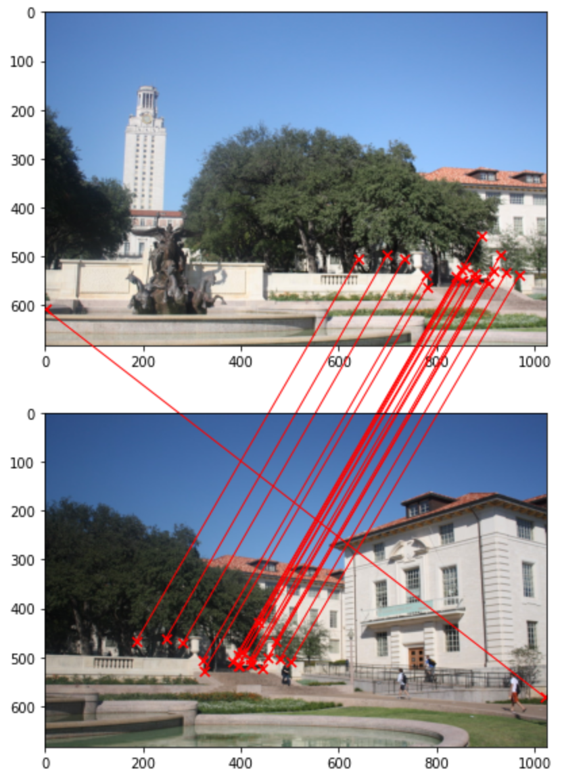
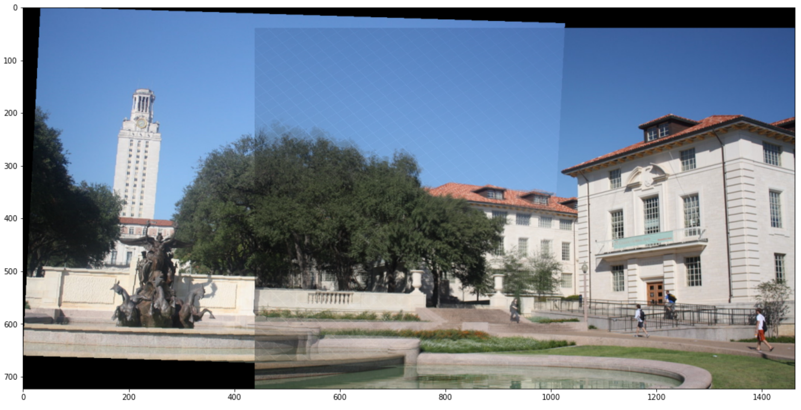
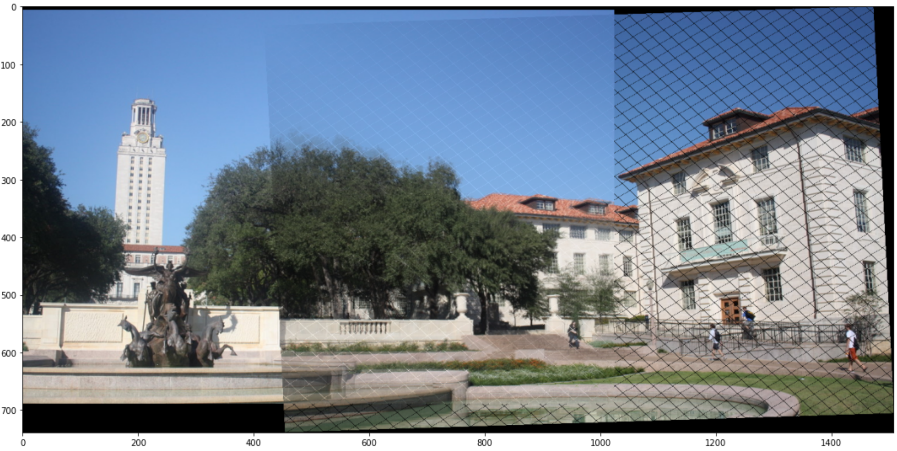

# Overview

The assignment solution can be found in 
- [feature-detection.ipynb](./feature-detection.ipynb) - Problem 1
- [image-stitching.ipynb](./image-stitching.ipynb) - Problem 2

## Feauture Detection Results

The following result can be found in location: `results/ncc_pairs.png`



## Panorama

The following result can be found in location: `results/panorama_left_transform_edge_blend.png`



The following result can be found in location: `results/panorama_right_transform_edge_blend.png`



# Dependencies

1. [Docker](https://www.docker.com/)

# Setup (in order to reproduce the code)

For ease of environment reproduction, we have created a [Dockerfile](./Dockerfile), which can be used to create a container with all the python packages pre-installed, by following the below mentioned steps: (_The following steps should be executed inside the directory where all the files have been extracted from the submitted zip file._)

1. How to build an image from dockerfile: 
```bash
docker build -f Dockerfile -t cv_hw_3 .
```

2. How to create a container from the above image: 
```bash
docker run --name cv_hw_3 -p 18888:8888 -itd cv_hw_3
```

Now, visit the url: [localhost:18888](http://localhost:18888) (password: `dgupta12_psood_asg3`)

# Only for development purposes

1. How to build an image from dockerfile:
```bash
docker build -f Dockerfile.dev -t cv_hw_3.dev .
```

2. For running development container:
```bash
docker run --name cv_hw_3.dev -p 13888:8888 -v ${pwd}:/assignment_3/ -itd cv_hw_3.dev
```

Now, visit the url: [localhost:13888](http://localhost:13888) (password: `dev`)